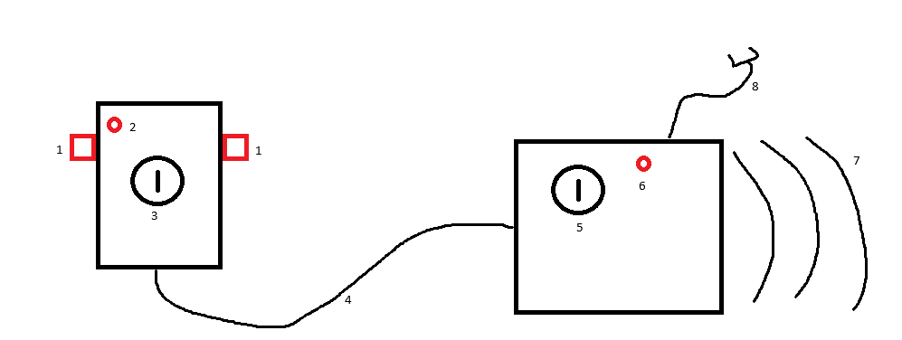

# SimpleLaunchController

## Aim

To create a simple launch controller for launching a single rocket at a time. It should be able to cope with igniting clusters of high power solid rocket motors at once (using a clip whip), at an appropriate distance, but does not need to be able to support hybrids or have multiple channels. It should meet all the requirements of the `Launch Controller` task in the United Kingdom Rocketry Association's Model Achievement Program.

## Rough sketch

The system consists of two parts, a hand held controller that stays at the flight line and allows launches to be triggered, and a box with the battery and the igniter clips that stays at the launch pad.

Key:
1) Two buttons, momentary on, which must be pressed at the same time to trigger a launch
2) A continuity indicator
3) A key switch, which requires the key to be in and turned on to allow a launch to be triggered
4) A long lead between the hand held controller and the battery box. This should be capable of being at least 150m long, although also easily manageable at much shorter distances too.
5) A key to disconnect the battery
6) A visual indicator that the battery is live
7) An audio indicator that the battery is live
8) A lead with two crocodile clips, for connecting to the igniter(s)
